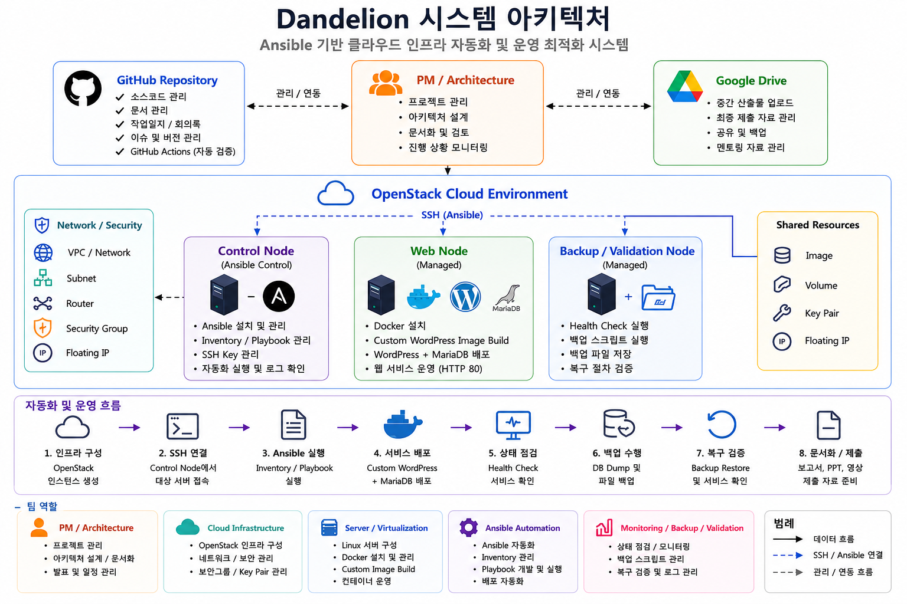

<!-- STATUS: COMPLETE -->

# Team Dandelion - Cloud Infrastructure Automation

## 1. 프로젝트 주제

Ansible 기반 클라우드 인프라 자동화 및 운영 최적화 시스템 구축

## 2. 프로젝트 방향

본 프로젝트는 OpenStack 기반 클라우드 인프라 환경에서 서버 구성, Ansible 기반 IaC 자동화, Docker 기반 서비스 배포, 상태 점검, 백업 및 복구 검증을 하나의 운영 흐름으로 연결하는 것을 목표로 한다.

단순한 서버 생성이나 애플리케이션 배포가 아니라, 반복적인 인프라 운영 작업을 코드화하고, 자동화 결과를 검증 가능한 형태로 남기는 데 중점을 둔다.

## 3. 평가 기준 대응 전략

| 평가항목 | 배점 | 프로젝트 대응 방향 |
|---|---:|---|
| 전문성 | 25 | OpenStack 인프라, Ansible IaC, Docker 서비스 배포, 모니터링/검증 활용 |
| 차별성 | 25 | 수동 운영 편차 문제를 Ansible 표준화와 GitHub 자동 상태 관리로 개선 |
| 완성도 | 25 | SSH 접속, Ansible ping, Playbook 실행, Docker/Nginx, Backup/Restore 성공 검증 |
| 프로젝트 관리 | 15 | GitHub Repository, 문서화, 팀원별 산출물 분리, GitHub Actions 자동 상태 갱신 |
| 발표 및 시연 | 10 | 인프라 구현 → 자동화 → 서비스 배포 → 검증 흐름 중심 시연 |

## 4. 팀 구성

| 이름 | 역할 | 담당 영역 |
|---|---|---|
| 박재우 | 모니터링 / 백업 / 검증 | 상태 점검, 백업 스크립트, 복구 테스트 |
| 백서빈 | 클라우드 인프라 | OpenStack 서버 생성, 네트워크, 보안그룹, SSH 접속 |
| 이진욱 | 서버 / 가상화 | Linux 기본 설정, Docker 설치, Nginx 컨테이너 |
| 정주헌 | PM / 아키텍처 | 전체 구조 설계, GitHub 관리, 문서 통합, 발표 흐름 정리 |
| 조민석 | Ansible 자동화 | inventory, ansible.cfg, playbook 작성 및 실행 |

## 5. 시스템 아키텍처 다이어그램

## 6. 핵심 구현 흐름

~~~text
OpenStack 인프라 구성
→ 네트워크 / 보안그룹 / 인스턴스 준비
→ SSH 접속 환경 구성
→ Ansible Inventory 작성
→ Ansible Playbook 실행
→ Docker 기반 Nginx 서비스 배포
→ 상태 점검
→ 백업 / 복구 검증
→ GitHub 기반 산출물 관리
~~~

## 7. 주요 기능

| 구분 | 구현 내용 | 평가 연결 |
|---|---|---|
| 인프라 구성 | OpenStack 인스턴스, 네트워크, 보안그룹 구성 | 전문성 |
| IaC 자동화 | Ansible inventory / ansible.cfg / site.yml 구성 | 전문성 / 완성도 |
| 서비스 배포 | Docker 기반 Nginx 컨테이너 실행 | 전문성 |
| 상태 점검 | health_check.sh 기반 서버 및 서비스 확인 | 완성도 |
| 백업 / 복구 | backup.sh 및 restore 절차 검증 | 완성도 |
| 프로젝트 관리 | GitHub Actions 기반 상태 자동 갱신 | 프로젝트 관리 / 차별성 |

## 8. 디렉터리 구조

~~~text
dandelion-cloud-automation/
├── README.md
├── docs/
├── ansible/
├── scripts/
├── screenshots/
├── presentation/
├── tools/
└── .github/workflows/
~~~

## 9. 문서 목록

| 문서 | 설명 |
|---|---|
| [Architecture](./docs/architecture.md) | 전체 시스템 아키텍처 |
| [Network Design](./docs/network-design.md) | 클라우드 인프라 및 네트워크 구성 |
| [Server Setup](./docs/server-setup.md) | 서버 및 Docker 구성 |
| [Ansible Automation](./docs/ansible-automation.md) | Ansible 자동화 구성 |
| [Validation Report](./docs/validation-report.md) | 모니터링, 백업, 복구 검증 |
| [Team Task Guide](./docs/team-task-guide.md) | 팀원별 작업 기준 |
| [Pre-Run Checklist](./docs/pre-run-checklist.md) | 실행 전 점검 기준 |
| [Troubleshooting Guide](./docs/troubleshooting.md) | 문제 해결 기준 |
| [Project Runbook](./docs/runbook.md) | 실행 절차 |
| [Scope Control Policy](./docs/scope-control.md) | 필수 구현 / 선택 확장 / 제외 범위 기준 |
| [Mentoring Brief](./docs/mentoring-brief.md) | 멘토링용 프로젝트 현황 요약 |
| [Mentoring Questions](./docs/mentoring-questions.md) | 멘토링 질문 목록 |
| [Final Deliverables Checklist](./docs/final-deliverables.md) | 최종 산출물 체크리스트 |
| [Review Checklist](./docs/review-checklist.md) | 팀원 자료 검수 기준 |
| [Project Status](./docs/project-status.md) | 자동 생성 프로젝트 상태 |
| [Validation Summary](./docs/validation-summary.md) | 자동 검수 결과 |
| [Presentation Outline](./presentation/presentation-outline.md) | 발표 흐름 및 멘트 |

## 10. 최종 성공 기준

| 단계 | 성공 기준 |
|---|---|
| 인프라 | OpenStack 인스턴스 및 보안그룹 구성 완료 |
| 접속 | Control Node에서 Managed Node SSH 접속 성공 |
| Ansible | ansible all -m ping 성공 |
| 자동화 | ansible-playbook site.yml 실행 성공 |
| 서비스 | Docker / Nginx 컨테이너 실행 및 HTTP 응답 성공 |
| 검증 | health check, backup, restore 결과 확인 |
| 관리 | GitHub 상태표 및 산출물 자동 갱신 확인 |

## 11. 프로젝트 핵심 메시지

~~~text
OpenStack 인프라 구성부터 Ansible 자동화, Docker 서비스 배포,
상태 점검, 백업/복구 검증, GitHub 기반 산출물 관리까지
하나의 인프라 운영 자동화 흐름으로 연결한다.
~~~

<!-- AUTO_STATUS_START -->
## 자동 생성 프로젝트 상태

아래 상태는 팀원이 파일을 push할 때 자동으로 갱신된다.

## 2. 전체 진행률

| 완료 | 전체 | 진행률 |
|---:|---:|---:|
| 16 | 51 | 31% |

## 담당자별 진행 상태

| 영역 | 담당자 | 완료 | 전체 | 진행률 | 상태 |
|---|---|---:|---:|---:|---|
| PM / Architecture | 정주헌 | 12 | 12 | 100% | ✅ 완료 |
| Cloud Infrastructure | 백서빈 | 0 | 5 | 0% | ❌ 미착수 |
| Server / Virtualization | 이진욱 | 0 | 5 | 0% | ❌ 미착수 |
| Ansible Automation | 조민석 | 0 | 9 | 0% | ❌ 미착수 |
| Monitoring / Backup / Validation | 박재우 | 0 | 9 | 0% | ❌ 미착수 |
| Submission Package | 정주헌 | 4 | 11 | 36% | 🟡 진행 중 |

상세 상태는 [Project Status](./docs/project-status.md) 문서에서 확인한다.

<!-- AUTO_STATUS_END -->

## 제출 패키지

Google Drive 최종 제출 산출물 목록은 아래 문서를 기준으로 관리한다.

- [Submission Package](./docs/submission-package.md)

