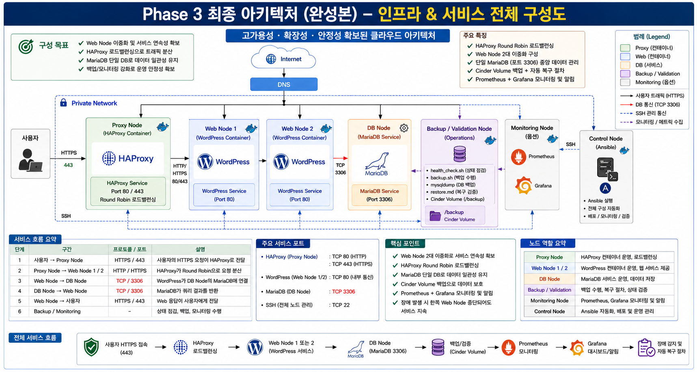

<!-- STATUS: COMPLETE -->

# Team Dandelion - Cloud Infrastructure Automation

## 1. 프로젝트 주제

Ansible 기반 클라우드 인프라 자동화 및 운영 최적화 시스템 구축

---

## 2. 프로젝트 개요

본 프로젝트는 OpenStack 기반 클라우드 인프라 환경에서 Ubuntu 인스턴스를 구성하고, Ansible을 활용하여 서버 설정, Docker 설치, Docker Compose 기반 WordPress와 DB Node MariaDB 서비스 서비스 배포, HAProxy Reverse Proxy 구성, 상태 점검, 백업 및 복구 검증을 자동화하는 것을 목표로 한다.

단순한 서버 생성이나 애플리케이션 배포가 아니라, 반복적인 인프라 운영 작업을 코드화하고, 자동화 결과를 검증 가능한 산출물로 남기는 데 중점을 둔다.

서비스 계층은 Docker Hub 공식 WordPress 이미지를 기반으로 생성한 Custom WordPress Image와 MariaDB Service를 Docker Compose로 구성한다.

본 프로젝트에서 WordPress는 웹 개발 대상이 아니라, Ansible 기반 배포 자동화, HTTP 상태 점검, MariaDB dump, WordPress files 백업, Restore 검증을 위한 컨테이너 서비스 대상이다.

---

## 3. Phase 기반 구현 전략

본 프로젝트는 기존 A급 / B급 / B+ 방식이 아니라 Phase 기반 구현 로드맵으로 범위를 정의한다.

~~~text
Phase 1: 필수 구성 및 기본 검증 단계
Phase 2: 운영 확장 및 검증 고도화 단계
Phase 3: 도전 확장 단계
Out of Scope: 제외 범위
~~~

---

## 4. 핵심 구현 흐름

~~~text
OpenStack 인프라 구성
→ Ubuntu 인스턴스 생성
→ Control / Proxy / Web / DB / Backup Node 분리
→ SSH 접속 환경 구성
→ Ansible Inventory 작성
→ Ansible Playbook 실행
→ Docker 설치
→ DB Node에 MariaDB 직접 설치
→ Web Node에 Custom WordPress 배포
→ Proxy Node에 HAProxy HTTP Reverse Proxy 구성
→ Proxy Node 경유 WordPress HTTP 접속 확인
→ Health Check
→ MariaDB dump 및 WordPress files 백업
→ Restore 절차 검증
→ GitHub 및 Google Drive 산출물 관리
~~~

---

## 5. 평가 기준 대응 전략

| 평가항목 | 배점 | 프로젝트 대응 방향 |
|---|---:|---|
| 전문성 | 25 | OpenStack 인프라, Ubuntu Instance, Proxy/Web/DB/Backup 계층 분리, Ansible IaC, Docker Compose, WordPress와 MariaDB, HAProxy Reverse Proxy, 백업/복구 검증 |
| 차별성 | 25 | 수동 운영 편차 문제를 Ansible 표준화, Dockerfile 기반 이미지 커스터마이징, Proxy/Web/DB 계층 분리, GitHub Actions 기반 산출물 상태 자동 갱신으로 개선 |
| 완성도 | 25 | SSH 접속, Ansible ping, Playbook 실행, WordPress와 MariaDB/HAProxy 배포, Health Check, Backup/Restore 성공 검증 |
| 프로젝트 관리 | 15 | GitHub Repository, 문서화, 팀원별 산출물 분리, 회의록/작업일지/제출자료 관리 |
| 발표 및 시연 | 10 | 인프라 구현 → 자동화 → 서비스 배포 → Proxy 경유 접속 → 상태 점검 → 백업/복구 검증 흐름 중심 시연 |

---

## 6. 팀 구성

| 이름 | 역할 | 담당 영역 |
|---|---|---|
| 정주헌 | PM / 아키텍처 | 전체 구조 설계, GitHub 관리, 문서 통합, 발표 흐름 정리 |
| 백서빈 | 클라우드 인프라 | OpenStack 인스턴스, Ubuntu 이미지, 네트워크, 보안그룹, Floating IP 또는 포트포워딩 접속 구성 |
| 이진욱 | 서버 / 가상화 | Linux 기본 설정, Docker 설치, Custom WordPress, MariaDB, HAProxy 컨테이너 구성 |
| 조민석 | Ansible 자동화 | ansible.cfg, inventory.ini, site.yml 작성 및 실행 |
| 박재우 | 모니터링 / 백업 / 검증 | health_check, backup, restore 검증 및 결과 정리 |

---

## 7. 최종 아키텍처 완성본

---

## 8. Phase 1: 필수 구성 및 기본 검증 단계

Phase 1은 최종 발표와 시연을 위해 반드시 완료해야 하는 필수 구성 단계이다.

Phase 1의 목표는 OpenStack 위에 Ubuntu 기반 인스턴스를 구성하고, Control Node, Proxy Node, Web Node, DB Node, Backup / Validation Node를 분리한 뒤, Ansible을 통해 Docker 기반 서비스를 배포하고, 상태 점검과 백업/복구 검증까지 완료하는 것이다.

~~~text
Client
→ Proxy Node
   └── HAProxy HTTP Reverse Proxy

→ Web Node
   └── Custom WordPress Container

→ DB Node
   └── MariaDB Service

→ Backup / Validation Node
   ├── health_check.sh
   ├── backup.sh
   ├── MariaDB dump
   ├── WordPress files archive
   └── restore.md 검증

Control Node
→ Ansible 실행
→ Proxy / Web / DB / Backup Node 관리
~~~

### Phase 1 필수 구성사항

| 구분 | 필수 구현 내용 |
|---|---|
| 인프라 | OpenStack 기반 Ubuntu 인스턴스 생성 |
| 노드 구성 | Control Node, Proxy Node, Web Node, DB Node, Backup / Validation Node 구분 |
| 네트워크 | 네트워크, 라우터, 서브넷 구성 |
| 접속 | SSH 접속 및 포트포워딩 또는 Floating IP 접속 검증 |
| 보안 | 보안그룹을 통한 SSH 및 HTTP 접근 제어 |
| Ansible | ansible.cfg, inventory.ini, site.yml 작성 및 실행 |
| 서비스 | Docker 설치 및 Docker Compose 실행 |
| DB | DB Node에 MariaDB 서비스 구성 |
| Web | Web Node에 Custom WordPress 컨테이너 구성 |
| Proxy | Proxy Node에 HAProxy HTTP Reverse Proxy 구성 |
| 검증 | Proxy Node 경유 WordPress HTTP 응답 확인 |
| 상태 점검 | health_check.sh 실행 |
| 백업 | MariaDB dump 및 WordPress files archive 생성 |
| 복구 | restore.md 기반 복구 절차 검증 |
| 문서 | IP 주소표, 보안그룹 및 포트표, 담당자별 수행 내역, 트러블슈팅 로그 정리 |
| 산출물 | 담당자별 캡처 및 제출자료 정리 |

---

## 9. Phase 2: 운영 확장 및 검증 고도화 단계

Phase 2는 Phase 1 구현과 필수 캡처가 완료된 이후 가능한 범위에서 진행한다.

Phase 2는 Phase 1 구조를 변경하는 것이 아니라, Phase 1 구조 위에 보안 강화, 스토리지 분리, 관측 가능성, 자동화 개선 요소를 추가하는 방향으로 진행한다.

| 우선순위 | 확장 항목 | 목적 |
|---:|---|---|
| 1 | HTTPS self-signed | HTTPS 접속 검증 |
| 2 | HTTP 80 → HTTPS 443 Redirect | 접속 보안 흐름 개선 |
| 3 | Cinder Backup Volume | 백업 저장소 분리 |
| 4 | node_exporter / cAdvisor | OS / Container 메트릭 수집 |
| 5 | Prometheus | 메트릭 수집 서버 구성 |
| 6 | Grafana | 대시보드 시각화 |
| 7 | backup / restore playbook화 | 운영 절차 자동화 개선 |
| 8 | Ansible roles 구조 분리 | playbook 구조 개선 |
| 9 | 상세 검증 리포트 고도화 | 발표 근거 강화 |
| 10 | 운영 장애 시나리오 확장 | 운영성 설명 강화 |

Phase 2가 실패하더라도 Phase 1 결과를 기준으로 발표할 수 있도록 범위를 분리한다.

---

## 10. Phase 3: 도전 확장 단계

Phase 3은 Phase 1과 Phase 2가 조기에 안정화되었을 경우 시도하는 도전 확장 단계이다.

Phase 3의 목표는 기존 Phase 1 구조를 유지하면서 Web Node를 2대로 확장하고, HAProxy를 통해 roundrobin 방식의 Load Balancing을 검증하는 것이다.

~~~text
Client
→ Proxy Node / HAProxy Load Balancer
→ Web Node 1 / WordPress
→ Web Node 2 / WordPress
→ DB Node / MariaDB
→ Backup / Validation Node
~~~

| 항목 | 검증 기준 |
|---|---|
| Web Node 2대 구성 | Web-1 / Web-2 모두 WordPress 응답 |
| HAProxy LB | roundrobin 기반 Web-1 / Web-2 분산 |
| 공통 DB Node | 두 Web Node가 동일 DB Node에 연결 |
| 장애 확인 | Web-1 중지 시 Web-2 응답 가능 여부 확인 |

Phase 3 시연은 HAProxy roundrobin, Web-1/Web-2 응답 분산, 공통 DB 연결 확인 수준으로 제한한다.

---

## 11. Out of Scope

다음 항목은 프로젝트 범위를 과도하게 확장할 수 있으므로 이번 구현 범위에서는 제외한다.

| 제외 항목 | 제외 이유 |
|---|---|
| OpenStack LBaaS / Octavia | OpenStack 서비스 의존성과 설정 난이도가 높음 |
| DB Replication | DB 복제 검증 범위가 별도 프로젝트 수준으로 확장됨 |
| DB Clustering | 장애 대응 및 데이터 정합성 검증 부담 증가 |
| Auto Scaling | 모니터링, 이미지, 배포 자동화까지 범위 확장 |
| Kubernetes | 현재 프로젝트의 Ansible / Docker Compose 중심과 범위 불일치 |
| Docker Swarm | Docker Compose 기반 실습 범위를 벗어남 |
| WordPress files 자동 동기화 | 파일 충돌, 권한, 공유 스토리지 이슈 발생 |
| Production-level HTTPS | 공인 도메인 및 인증서 자동 갱신 범위 필요 |

---

## 12. 디렉터리 구조

~~~text
dandelion-cloud-automation/
├── README.md
├── docs/
├── ansible/
├── docker/
│   ├── wordpress/
│   │   ├── Dockerfile
│   │   ├── custom.ini
│   │   └── README.md
│   ├── compose/
│   │   └── docker-compose.yml
│   ├── proxy/
│   │   ├── docker-compose.yml
│   │   └── haproxy.cfg
│   └── monitoring/
│       ├── docker-compose.yml
│       └── prometheus.yml
├── scripts/
├── screenshots/
├── presentation/
├── submission/
├── tools/
└── .github/workflows/
~~~

---

## 13. 문서 목록

| 문서 | 설명 |
|---|---|
| [Architecture](./docs/architecture.md) | 전체 시스템 아키텍처 |
| [Network Design](./docs/network-design.md) | 클라우드 인프라 및 네트워크 구성 |
| [Server Setup](./docs/server-setup.md) | 서버 및 Docker 구성 |
| [Ansible Automation](./docs/ansible-automation.md) | Ansible 자동화 구성 |
| [Validation Report](./docs/validation-report.md) | 모니터링, 백업, 복구 검증 |
| [Team Task Guide](./docs/team-task-guide.md) | 팀원별 작업 기준 |
| [Pre-Run Checklist](./docs/pre-run-checklist.md) | 실행 전 점검 기준 |
| [Troubleshooting Guide](./docs/troubleshooting.md) | 문제 해결 기준 |
| [Project Runbook](./docs/runbook.md) | 실행 절차 |
| [Scope Control Policy](./docs/scope-control.md) | Phase 기반 구현 범위 통제 기준 |
| [Implementation Roadmap](./docs/implementation-roadmap.md) | Phase 1 / Phase 2 / Phase 3 구현 순서 |
| [Mentoring Brief](./docs/mentoring-brief.md) | 멘토링용 프로젝트 현황 요약 |
| [Mentoring Questions](./docs/mentoring-questions.md) | 멘토링 질문 목록 |
| [Final Deliverables Checklist](./docs/final-deliverables.md) | 최종 산출물 체크리스트 |
| [Review Checklist](./docs/review-checklist.md) | 팀원 자료 검수 기준 |
| [Project Status](./docs/project-status.md) | 자동 생성 프로젝트 상태 |
| [Validation Summary](./docs/validation-summary.md) | 자동 검수 결과 |
| [Presentation Outline](./presentation/presentation-outline.md) | 발표 흐름 및 멘트 |
| [Submission Package](./docs/submission-package.md) | Google Drive 최종 제출 산출물 기준 |
| [Custom WordPress Image](./docker/wordpress/README.md) | 커스텀 WordPress 이미지 설명 |

---

## 14. 최종 성공 기준

| 단계 | 성공 기준 |
|---|---|
| 인프라 | OpenStack 기반 Ubuntu 인스턴스 생성 완료 |
| 노드 | Control / Proxy / Web / DB / Backup Node 구분 완료 |
| 접속 | Control Node에서 Managed Node SSH 접속 성공 |
| Ansible | ansible all -m ping 성공 |
| 자동화 | ansible-playbook site.yml 실행 성공 |
| DB | DB Node에서 MariaDB 서비스 running |
| Web | Web Node에서 Custom WordPress 컨테이너 running |
| Proxy | Proxy Node에서 HAProxy HTTP Reverse Proxy 동작 |
| 연결 | Web Node WordPress가 DB Node MariaDB에 연결 |
| 접속 검증 | Proxy Node 경유 WordPress HTTP 응답 확인 |
| 검증 | health_check, backup, restore 결과 확인 |
| 운영 | 주요 장애 시나리오와 트러블슈팅 절차 정리 |
| 관리 | GitHub 상태표 및 산출물 자동 갱신 확인 |

---

## 15. 구현 일정 기준

| 구분 | 목표 완료일 | 기준 |
|---|---|---|
| Phase 1 필수 구성 | 2026-06-26 | OpenStack, Ubuntu Instance, Control / Proxy / Web / DB / Backup Node, SSH, Ansible, Docker Compose, WordPress와 MariaDB, HAProxy HTTP Reverse Proxy, Health Check, Backup/Restore, 필수 캡처 완료 |
| Phase 2 운영 확장 | 2026-07-10 | HTTPS, Cinder Backup Volume, node_exporter, cAdvisor, Prometheus/Grafana, Playbook 개선 중 가능한 항목 |
| Phase 3 도전 확장 | 2026-07-10 이전 여유 시 | Web Node 2대, HAProxy Load Balancing, 공통 DB 연결 검증 |
| 최종 정리 | 2026-07-14 | 결과보고서, 시연 영상, 소스코드, 작업일지, 회의록, Google Drive 제출자료 정리 |

---

## 16. 프로젝트 핵심 메시지

~~~text
OpenStack 인프라 구성부터 Ansible 자동화, Proxy / Web / DB / Backup 계층 분리,
Docker Compose 기반 WordPress와 DB Node MariaDB 서비스 서비스 배포, HAProxy HTTP Reverse Proxy,
상태 점검, DB 및 파일 백업, 복구 절차 검증, GitHub 기반 산출물 관리까지
하나의 인프라 운영 자동화 흐름으로 연결한다.
~~~

<!-- AUTO_STATUS_START -->
## 자동 생성 프로젝트 상태

아래 상태는 팀원이 파일을 push할 때 자동으로 갱신된다.

## 2. 전체 진행률

| 완료 | 전체 | 진행률 |
|---:|---:|---:|
| 20 | 51 | 39% |

## 담당자별 진행 상태

| 영역 | 담당자 | 완료 | 전체 | 진행률 | 상태 |
|---|---|---:|---:|---:|---|
| PM / Architecture | 정주헌 | 12 | 12 | 100% | ✅ 완료 |
| Cloud Infrastructure | 백서빈 | 1 | 5 | 20% | 🟡 진행 중 |
| Server / Virtualization | 이진욱 | 1 | 5 | 20% | 🟡 진행 중 |
| Ansible Automation | 조민석 | 1 | 9 | 11% | 🟡 진행 중 |
| Monitoring / Backup / Validation | 박재우 | 0 | 9 | 0% | ❌ 미착수 |
| Submission Package | 정주헌 | 5 | 11 | 45% | 🟡 진행 중 |

상세 상태는 [Project Status](./docs/project-status.md) 문서에서 확인한다.

<!-- AUTO_STATUS_END -->

