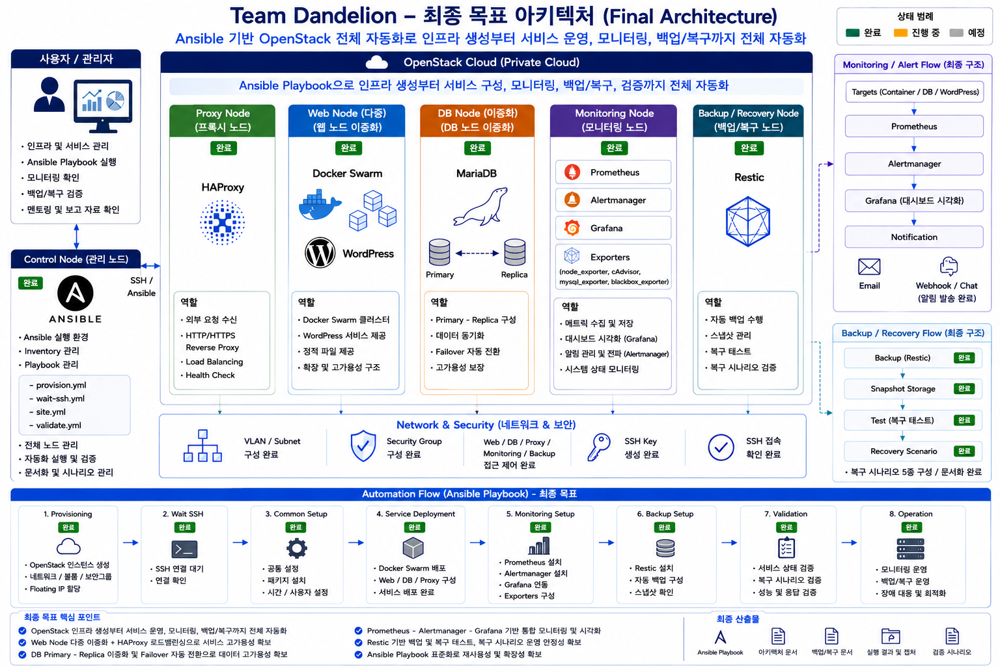

<!-- STATUS: CURRENT -->

# Architecture

## 1. 문서 목적

본 문서는 Team Dandelion 프로젝트의 최신 아키텍처 기준을 정의한다.

과거 회의록, 작업일지, 날짜별 작업 문서에는 작성 당시 기준의 구조가 포함될 수 있다.  
멘토링 및 발표 기준의 최신 구조는 본 문서를 우선 기준으로 한다.

---

## 2. 프로젝트 주제

```text
Ansible 기반 클라우드 인프라 자동화 및 운영 최적화 시스템 구축
```

본 프로젝트는 OpenStack 기반 클라우드 인프라 위에 Web, DB, Proxy, Monitoring, Backup / Recovery 구성 요소를 배치하고, Control Node에서 Ansible Playbook과 운영 스크립트를 통해 인프라 생성, 서비스 구성, 모니터링, 백업 및 복구 검증을 자동화하는 것을 목표로 한다.

---

## 3. 최종 목표 아키텍처

## 최종 목표 아키텍처 그림



최종 목표는 Control Node에서 Ansible Playbook을 실행하여 다음 흐름을 자동화하는 것이다.

```text
Control Node
→ Ansible Playbook 실행
→ OpenStack 인스턴스 생성
→ 네트워크 / 보안그룹 / 볼륨 구성
→ Inventory 구성
→ 공통 환경 설정
→ Web / DB / Proxy / Monitoring / Backup 구성
→ 백업 및 복구 검증
→ 운영 상태 검증
```

---

## 4. 전체 구성 개요

```text
Admin
  |
  | SSH
  v
Control Node
  |
  | Ansible
  v
OpenStack Managed Nodes
  |
  +-- Proxy Node
  |     +-- HAProxy
  |
  +-- Web Node
  |     +-- Docker
  |     +-- Docker Swarm
  |     +-- WordPress Service
  |
  +-- DB Node
  |     +-- MariaDB
  |     +-- Replica 검증 진행
  |
  +-- Monitoring Node
  |     +-- Prometheus
  |     +-- node_exporter
  |     +-- cAdvisor
  |     +-- mysqld_exporter
  |     +-- blackbox_exporter
  |     +-- Grafana
  |     +-- Alertmanager
  |
  +-- Backup / Recovery Node
        +-- Restic
        +-- Backup Scripts
        +-- Restore Test
        +-- Recovery Scenarios
```

---

## 5. 서비스 트래픽 흐름

서비스 사용자는 Proxy / HAProxy 경로를 통해 Web 서비스에 접근한다.

```text
User
→ Proxy / HAProxy
→ Docker Swarm 기반 Web Service
→ MariaDB DB
```

Proxy 영역은 외부 요청을 내부 Web 서비스로 전달하는 역할을 수행한다.

Web 서비스 영역은 Docker Swarm 기반으로 구성하며, 서비스 배포와 운영 구조를 컨테이너 기반으로 정리한다.

---

## 6. 운영 관리 흐름

운영자는 Control Node에 접속하여 Ansible Playbook을 실행한다.

```text
Admin
→ Control Node
→ Ansible Inventory
→ Ansible Playbook
→ Managed Nodes
```

Control Node는 다음 역할을 수행한다.

| 역할 | 설명 |
|---|---|
| 중앙 제어 | 전체 노드에 대한 Ansible 실행 지점 |
| Inventory 관리 | 관리 대상 노드 정의 |
| Playbook 실행 | 공통 설정, 서비스 구성, 모니터링, 백업 자동화 |
| 검증 실행 | ping, 서비스 응답, 백업 상태, 복구 테스트 확인 |
| 문서 기준점 | 실행 결과와 운영 상태를 문서화하는 기준점 |

---

## 7. 노드별 역할

| 노드 | 역할 | 주요 구성 |
|---|---|---|
| Control Node | 중앙 관리 및 Ansible 실행 | Ansible, Inventory, Playbooks |
| Proxy Node | 외부 요청 전달 및 Proxy 처리 | HAProxy |
| Web Node | Web 서비스 실행 | Docker, Docker Swarm, WordPress |
| DB Node | 데이터베이스 서비스 | MariaDB, Replica 검증 |
| Monitoring Node | 운영 모니터링 | Prometheus, Exporter, Grafana, Alertmanager |
| Backup / Recovery Node | 백업 및 복구 검증 | Restic, Backup Scripts, Restore Test |

---

## 8. 자동화 계층

본 프로젝트의 자동화는 다음 계층으로 구분한다.

| 계층 | 설명 | 상태 |
|---|---|---|
| Provisioning Automation | OpenStack 인스턴스, 네트워크, 보안그룹, 볼륨 생성 자동화 | 보완 필요 |
| Configuration Automation | 생성된 서버의 공통 설정 및 패키지 구성 | 진행 / 일부 완료 |
| Service Deployment Automation | Web, DB, Proxy 서비스 구성 | 진행 / 구조 변경 반영 중 |
| Monitoring Automation | Prometheus, Exporter, Grafana, Alertmanager 구성 | 설치 완료 / 설정 진행 |
| Backup Automation | Restic 기반 백업 구성 | Web / DB / Proxy 완료 |
| Recovery Validation | 복구 테스트 및 복구 시나리오 검증 | 테스트 실시 / 문서화 진행 |
| Operation Optimization | 운영 상태 검증 및 장애 대응 문서화 | 진행 중 |

---

## 9. 최신 구성 상태

| 영역 | 최신 상태 |
|---|---|
| Infrastructure | OpenStack 인스턴스 구성 및 구조 수정 완료 |
| Timezone | 한국표준시 설정 완료 |
| Web | 단일 Web Node 위 Docker Swarm 기반 구성 완료 |
| Proxy | HAProxy 구성 완료 |
| DB | MariaDB Replica 기반 이중화 검증 진행 중 |
| Monitoring | Prometheus, Exporter, Grafana, Alertmanager 설치 완료 |
| Monitoring Config | Grafana / Alertmanager 설정 진행 중 |
| Backup | Restic 기반 Web / DB / Proxy 백업 완료 |
| Recovery | 복구 테스트 실시, 복구 시나리오 5종 구성 |
| Ansible | 구조 변경 대응 Playbook 수정 및 검증 진행 |
| Provisioning | OpenStack 인스턴스 생성 자동화 보완 필요 |

---

## 10. 과거 구조와 최신 구조 구분

과거 문서에는 다음과 같은 구조가 포함될 수 있다.

| 과거 구조 | 최신 기준 |
|---|---|
| Web1 / Web2 개별 노드 구성 | 단일 Web Node 위 Docker Swarm 기반 구성 |
| HAProxy Round Robin 중심 구조 | HAProxy 구성 + Docker Swarm 기반 Web 서비스 흐름 |
| 단일 DB Node | MariaDB Replica 이중화 검증 진행 |
| Prometheus 설치 예정 | Prometheus / Exporter / Grafana / Alertmanager 설치 완료 |
| backup.sh 중심 백업 | Restic 기반 백업 및 복구 테스트 |
| DB 이중화 Post-Phase | 현재 확장 검증 항목으로 관리 |
| 생성된 인스턴스 대상 구성 자동화 | 최종 목표는 OpenStack Provisioning부터 자동화 |

과거 기록 문서는 작성 당시 기준으로 보존한다.  
최신 기준은 본 문서와 `docs/current-status.md`, `docs/automation-scope.md`를 따른다.

---

## 11. 권장 최종 실행 흐름

최종적으로 다음 순서의 Playbook 구조를 목표로 한다.

```text
site.yml
├── provision.yml
├── wait-ssh.yml
├── common.yml
├── docker-swarm.yml
├── database.yml
├── proxy.yml
├── monitoring.yml
├── backup.yml
└── validate.yml
```

각 Playbook의 목적은 다음과 같다.

| Playbook | 목적 |
|---|---|
| provision.yml | OpenStack 인스턴스, 보안그룹, 볼륨, Floating IP 구성 |
| wait-ssh.yml | 생성된 인스턴스 SSH 접속 가능 상태 확인 |
| common.yml | 공통 패키지, 시간대, 기본 디렉터리 구성 |
| docker-swarm.yml | Docker 및 Swarm 기반 Web 서비스 구성 |
| database.yml | MariaDB 및 Replica 구성 |
| proxy.yml | HAProxy 구성 |
| monitoring.yml | Prometheus, Exporter, Grafana, Alertmanager 구성 |
| backup.yml | Restic 및 백업 스크립트 구성 |
| validate.yml | 서비스 상태, 모니터링, 백업, 복구 결과 검증 |

---

## 12. 멘토링 설명 기준

멘토링 시 본 아키텍처는 다음과 같이 설명한다.

```text
현재 프로젝트는 OpenStack 기반 인프라 위에 Web, DB, Proxy, Monitoring, Backup / Recovery 구성 요소를 배치하고,
Control Node에서 Ansible을 통해 구성 자동화와 운영 검증 자동화를 수행하는 구조입니다.

현재까지는 생성된 인스턴스 기반으로 서비스 구성, 모니터링, 백업 및 복구 검증을 구현했습니다.

최종 목표는 OpenStack 인스턴스 생성부터 Ansible Playbook으로 연결하는 것이며,
이를 위해 Provisioning Playbook을 추가 보완 범위로 정리했습니다.
```

