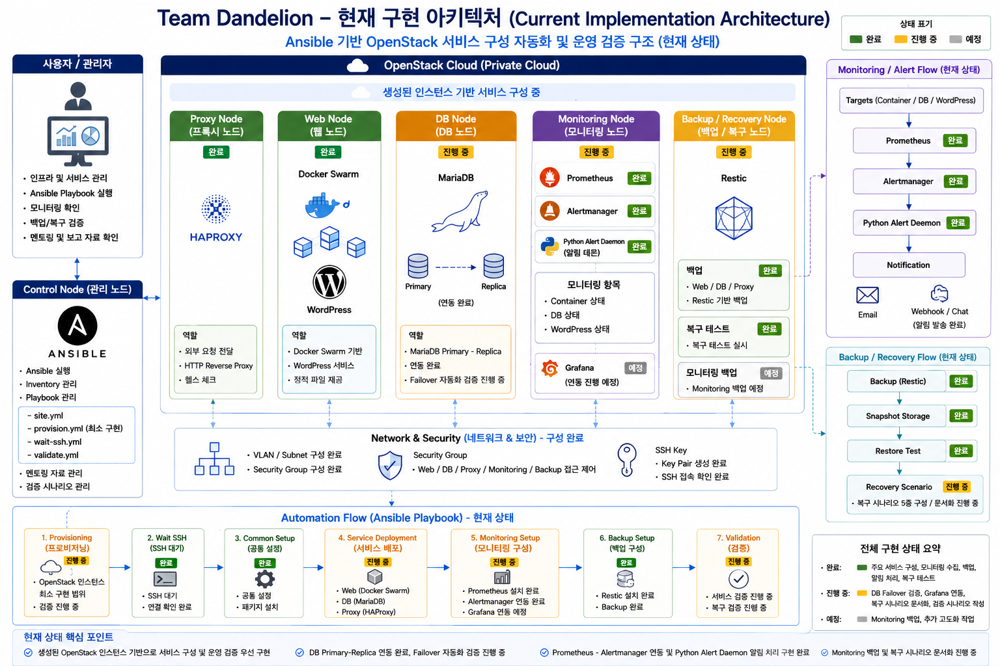

<!-- STATUS: CURRENT -->

# Current Project Status

## 1. 문서 목적

본 문서는 Team Dandelion 프로젝트의 최신 진행 상태를 정리한다.

과거 작업 기록, 회의록, 작업일지에는 당시 기준의 구조가 포함될 수 있으므로, 멘토링 및 발표 준비 시 최신 기준은 본 문서를 우선 기준으로 한다.

---

## 2. 프로젝트 주제

```text
Ansible 기반 클라우드 인프라 자동화 및 운영 최적화 시스템 구축
```

본 프로젝트는 OpenStack 기반 클라우드 인프라 위에 Web, DB, Proxy, Monitoring, Backup / Recovery 구성 요소를 배치하고, Control Node에서 Ansible Playbook과 운영 스크립트를 통해 인프라 구성, 서비스 배포, 모니터링, 백업 및 복구 검증을 자동화하는 것을 목표로 한다.

---

## 3. 최종 목표

최종 목표는 다음과 같다.

```text
Control Node에서 Ansible Playbook 실행
→ OpenStack 인스턴스 생성
→ 네트워크 / 보안그룹 / 볼륨 구성
→ Inventory 구성
→ 공통 환경 설정
→ 서비스 배포
→ 모니터링 구성
→ 백업 및 복구 검증
→ 운영 상태 검증
```

현재는 생성된 인스턴스를 기반으로 서비스 구성, 모니터링, 백업 및 복구 검증 자동화를 우선 구현하였으며, OpenStack 인스턴스 생성 자동화는 최종 목표 달성을 위한 추가 보완 범위로 둔다.

---

## 4. 최신 아키텍처 기준

## 현재 구현 아키텍처



| 영역 | 최신 기준 |
|---|---|
| Control Node | Ansible 실행 및 전체 노드 중앙 관리 |
| Cloud Infra | OpenStack 인스턴스, 네트워크, 보안그룹, 디스크, 시간대 구성 |
| Web | 단일 Web Node 위 Docker Swarm 기반 서비스 구성 |
| Proxy | HAProxy 구성, 외부 요청을 Web 서비스 영역으로 전달 |
| DB | MariaDB 기반 DB 구성, Replica 이중화 검증 진행 중 |
| Monitoring | Prometheus, node_exporter, cAdvisor, mysqld_exporter, blackbox_exporter, Grafana, Alertmanager |
| Backup / Recovery | Restic 기반 Web / DB / Proxy 백업 및 복구 테스트 |
| Validation | 복구 시나리오 5종 구성 및 문서화 진행 |

---

## 5. 완료 항목

| 분류 | 완료 내용 |
|---|---|
| Infrastructure | OpenStack 기반 인스턴스 구성 |
| Infrastructure | 인스턴스 구조 수정 |
| Infrastructure | 한국표준시 기준 시간 설정 |
| Web | 단일 Web Node 기반 Docker Swarm 재구성 |
| Proxy | HAProxy 구성 |
| Monitoring | Prometheus 설치 |
| Monitoring | node_exporter 설치 |
| Monitoring | cAdvisor 설치 |
| Monitoring | mysqld_exporter 설치 |
| Monitoring | blackbox_exporter 설치 |
| Monitoring | Grafana 설치 |
| Monitoring | Alertmanager 설치 |
| Backup | Restic 설치 |
| Backup | Web / DB / Proxy Node 백업 진행 |
| Recovery | 백업 데이터 기반 복구 테스트 실시 |
| Recovery | 복구 시나리오 5종 구성 |
| Documentation | 회의록 및 작업일지 지속 작성 |

---

## 6. 진행 중 항목

| 분류 | 진행 내용 |
|---|---|
| Provisioning Automation | OpenStack 인스턴스 생성 자동화 Playbook 보완 |
| Ansible | 구조 변경 대응 Playbook 수정 및 검증 |
| Database | MariaDB Replica 이중화 검증 |
| Monitoring | Grafana 세부 설정 |
| Monitoring | Alertmanager 세부 설정 |
| Backup | Monitoring 파트 백업 항목 추가 |
| Recovery | 복구 시나리오 문서 작성 |
| Documentation | 최신 아키텍처 기준 문서 정리 |
| Presentation | 멘토링 및 최종 발표자료 반영 |

---

## 7. 예정 항목

| 분류 | 예정 내용 |
|---|---|
| Provisioning | OpenStack 인스턴스 생성 Playbook 작성 |
| Provisioning | Security Group / Volume / Floating IP 자동화 |
| Automation | Inventory 자동 생성 또는 갱신 |
| Automation | site.yml 통합 실행 구조 정리 |
| Validation | 전체 Playbook 실행 검증 |
| Validation | 멱등성 검증 |
| Monitoring | Dashboard / Alert Rule 검증 |
| Backup | Monitoring 구성 백업 추가 |
| Recovery | restore 문서 완료 |
| Submission | 최종 결과보고서 및 발표자료 정리 |

---

## 8. 과거 문서와 최신 기준 구분

과거 문서에는 다음과 같은 이전 구조가 포함될 수 있다.

| 과거 표현 | 최신 기준 |
|---|---|
| Web1 / Web2 + HAProxy Round Robin | 단일 Web Node 위 Docker Swarm 기반 Web 구성 |
| Proxy Node Load Balancer 역할 | Proxy Node는 HAProxy 기반 Proxy 역할로 정리 |
| 단일 DB Node | MariaDB Replica 이중화 검증 진행 중 |
| Prometheus 설치 예정 | Monitoring Stack 주요 구성 요소 설치 완료 |
| backup.sh 중심 백업 | Restic 기반 백업 및 복구 테스트 |
| DB 이중화 Post-Phase | 현재는 확장 진행 / 검증 항목으로 관리 |
| OpenStack 인스턴스 수동 생성 | 최종 목표는 Provisioning Playbook 자동화 |

과거 회의록과 작업일지는 작성 당시 기준을 보존한다.  
최신 멘토링 기준은 본 문서와 `docs/architecture.md`, `docs/automation-scope.md`, `docs/mentoring-brief.md`를 따른다.

---

## 9. 멘토링 기준 요약

현재 프로젝트는 단순 서버 구축이 아니라 다음 구조로 확장되었다.

```text
OpenStack 기반 클라우드 인프라
+ Ansible 기반 구성 자동화
+ Docker Swarm 기반 Web 서비스 구성
+ MariaDB Replica 검증
+ Prometheus / Grafana / Alertmanager 운영 모니터링
+ Restic 기반 백업 및 복구 검증
+ 복구 시나리오 기반 운영 검증
```

멘토링 시 핵심 설명은 다음과 같다.

```text
현재까지는 생성된 OpenStack 인스턴스 위에서 서비스 구성, 모니터링, 백업 및 복구 검증 자동화를 구현했습니다.

최종 목표는 Control Node에서 Ansible Playbook을 실행하여 OpenStack 인스턴스 생성부터 서비스 구성, 모니터링, 백업 및 복구 검증까지 연결하는 것입니다.

따라서 현재 문서 정리에서는 완료된 Day-1 / Day-2 자동화 범위와, 추가 구현할 OpenStack Provisioning 자동화 범위를 분리해서 정리하고 있습니다.
```

---

## 10. 2026-07-01 최신 진행상황

| 담당 | 최신 진행상황 | 상태 |
|---|---|---|
| 이진욱 | DB Primary - Replica 연동 완료, Primary 장애 시 Replica 전환 자동화 또는 Failover 검증 진행 중 | 진행 |
| 백서빈 | 장애대응 절차서 작성 완료, 보안그룹 수정 완료 | 완료 |
| 조민석 | Docker Swarm Playbook 작성 및 적용 완료, Restic Playbook 작성 및 적용 완료 | 완료 |
| 박재우 | Prometheus - Alertmanager 연동 완료, Container / DB / WordPress 장애 알림 Python Daemon 구현 완료, Grafana 연동 예정 | 진행 |
| 정주헌 | 멘토링 대비 자료 준비 및 검증 시나리오 작성 중 | 진행 |

### 10.1 멘토링 기준 업데이트

~~~text
최근 진행 결과로 Ansible 자동화와 운영 검증 범위가 강화되었다.

Docker Swarm과 Restic은 Playbook 작성 및 적용 완료로 설명할 수 있으며,
Monitoring은 Prometheus - Alertmanager 연동 및 장애 알림 Daemon 구현 완료로 설명한다.

DB는 Primary - Replica 연동 완료 상태이며,
Failover 자동화 또는 장애 시 Replica 전환 검증은 진행 중으로 구분한다.
~~~


---

## 11. 2026-07-02 멘토링 결과 반영

| 구분 | 작업 방향 |
|---|---|
| 3주차 | 구현 마무리 작업 |
| 4주차 | 가용성 테스트, 부하 테스트, 임계치 검증, DR 점검, 발표자료 준비 |

### 11.1 담당자 진행상황 업데이트

| 담당 | 최신 진행상황 | 상태 |
|---|---|---|
| 이진욱 | DB Failover 테스트 진행 중 | 진행 |

### 11.2 멘토링 이후 기준

~~~text
멘토링 이후 남은 기간에는 신규 기능 확장보다 현재 구현된 기능의 마무리와 검증에 집중한다.

3주차는 구현 마무리,
4주차는 가용성 테스트, 부하 테스트, 임계치 검증, DR 점검, 발표자료 준비를 중심으로 진행한다.
~~~

---

## 13. 2026-07-03 진행상황 업데이트

| 담당 | 최신 진행상황 | 상태 |
|---|---|---|
| 조민석 | Restore 자동화 구현 완료, 검증 예정 | 진행 |
| 이진욱 | DB 이중화 Failover 테스트 및 복구 점검 완료 | 완료 |
| 인프라 담당 | 다음 주 모니터링 파트 보조 예정 | 예정 |
| 서비스 담당 | 다음 주 자동화 파트 보조 예정 | 예정 |

### 13.1 업데이트 후 기준

~~~text
DB 파트는 Primary - Replica 연동 이후 Failover 테스트와 복구 점검까지 완료된 상태로 정리한다.

Restore 자동화는 구현 완료 상태이며,
실제 복구 동작 검증은 예정 항목으로 분리한다.

다음 주에는 인프라 담당자와 서비스 담당자가 각각 모니터링 파트와 자동화 파트를 보조하여
가용성 테스트, 부하 테스트, 임계치 검증, DR 점검, 발표자료 준비를 지원한다.
~~~

---

## 15. 2026-07-06 진행상황 업데이트

| 담당 | 최신 진행상황 | 상태 |
|---|---|---|
| 백서빈 | Prometheus - Alertmanager 연동 완료, Dashboard Alert 상태 출력 진행 중 | 진행 |
| 조민석 | Monitoring 제외 복구 Playbook 작성 및 검증 완료 | 완료 |
| 이진욱 | Ansible 기반 인스턴스 생성 Playbook 작성 완료, 보안그룹 / 서브넷 / Flavor / Image 생성 Playbook 작성 예정 | 진행 |
| 박재우 | Alertmanager 설정 수정 후 Mail Alert 테스트 점검 | 진행 |

### 15.1 업데이트 후 기준

~~~text
Monitoring 파트는 Prometheus - Alertmanager 연동 완료 상태이며,
Dashboard에서 Alert 상태를 출력하는 작업을 진행 중이다.

Recovery Automation 파트는 Monitoring을 제외한 복구 Playbook 작성 및 검증이 완료된 상태로 정리한다.

OpenStack Provisioning 파트는 인스턴스 생성 Playbook 작성 완료 상태이며,
보안그룹, 서브넷, Flavor, Image 생성 Playbook은 예정 항목으로 분리한다.

Alert Notification 파트는 Alertmanager 설정 수정 후 Mail Alert 테스트를 점검 중인 상태로 정리한다.
~~~
