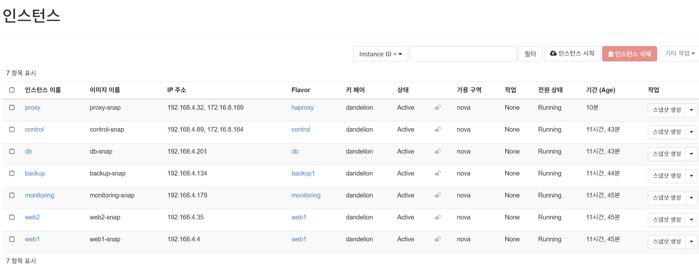
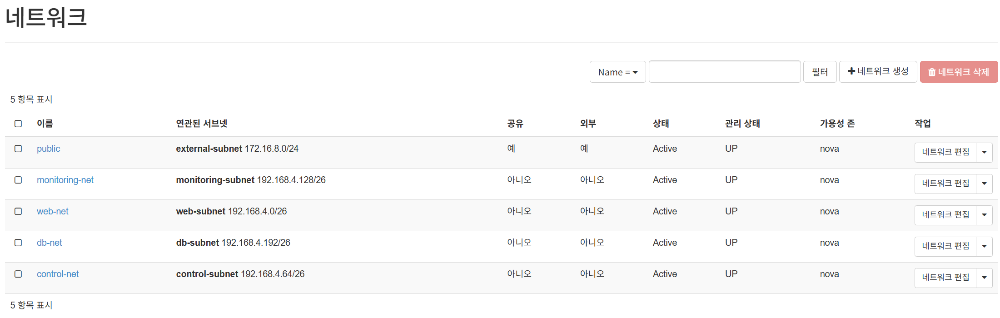

<!-- STATUS: COMPLETE -->

# Network Design

## 1. 문서 목적

본 문서는 Team Dandelion 프로젝트의 OpenStack 네트워크 구성, 노드 간 통신 흐름, 보안그룹 정책, 외부 접속 방식을 정의한다.

본 프로젝트는 Phase 기반 구현 로드맵을 사용한다.

~~~text
Phase 1: 필수 구성 및 기본 검증 단계
Phase 2: 운영 확장 및 검증 고도화 단계
Phase 3: 도전 확장 단계
Out of Scope: 제외 범위
~~~

본 문서는 Phase 1의 Control / Proxy / Web / DB / Backup Node 분리 구조를 기준으로 작성한다.

---

## 2. Phase 1 네트워크 목표

Phase 1의 네트워크 목표는 OpenStack 환경에서 Ubuntu 기반 인스턴스를 생성하고, 각 노드가 역할에 맞게 통신할 수 있도록 네트워크, 라우터, 서브넷, 보안그룹, 접속 경로를 구성하는 것이다.

Phase 1에서는 다음 통신 흐름을 반드시 검증한다.

~~~text
Admin / Control
→ SSH
→ Proxy / Web / DB / Backup Node

Client
→ Proxy Node:80
→ Web Node:80
→ DB Node:3306

Backup / Validation Node
→ Web Node
→ DB Node
~~~

---

## 3. Phase 1 노드 구성

| Node | Role | Main Service | Network Role |
|---|---|---|---|
| Control Node | Ansible 실행 | Ansible | 관리 노드 |
| Proxy Node | 외부 HTTP 진입점 | HAProxy HTTP Reverse Proxy | Client 요청 수신 |
| Web Node | WordPress 서비스 | Custom WordPress Container | Proxy 요청 처리 |
| DB Node | 데이터베이스 | MariaDB Service | Web Node DB 연결 처리 |
| Backup / Validation Node | 상태 점검 / 백업 / 복구 검증 | health_check.sh, backup.sh | 검증 및 백업 수행 |

---

## 4. 기본 네트워크 구조

## 4.1 논리 구조

~~~text
External Client
→ Floating IP or Port Forwarding
→ Proxy Node
→ Web Node
→ DB Node

Control Node
→ SSH / Ansible
→ Proxy Node
→ Web Node
→ DB Node
→ Backup / Validation Node

Backup / Validation Node
→ Health Check
→ Backup
→ Restore Validation
~~~

---

## 4.2 OpenStack 구성 요소

| 구분 | 구성 요소 | 설명 |
|---|---|---|
| Network | Private Network | 프로젝트 내부 노드 통신용 네트워크 |
| Subnet | Private Subnet | Control / Proxy / Web / DB / Backup Node가 사용하는 내부 대역 |
| Router | OpenStack Router | 내부 네트워크와 외부 네트워크 연결 |
| External Network | Provider / External Network | Floating IP 또는 외부 접속 제공 |
| Security Group | SSH / HTTP / DB 접근 제어 | 노드별 허용 포트 제어 |
| Floating IP | 선택 | Proxy Node 또는 Control Node 외부 접속용 |
| Port Forwarding | 선택 | 실습 환경에서 외부 접속을 대체하는 방식 |

---

## 5. 권장 IP 주소표

실제 IP는 실습 환경에 맞게 변경한다.

| Node | Example Private IP | External Access | Description |
|---|---|---|---|
| Control Node | 10.0.0.10 | SSH only | Ansible 실행 |
| Proxy Node | 10.0.0.20 | HTTP 80 | HAProxy HTTP Reverse Proxy |
| Web Node | 10.0.0.30 | Internal only | WordPress |
| DB Node | 10.0.0.40 | Internal only | MariaDB |
| Backup / Validation Node | 10.0.0.50 | SSH only | Health Check / Backup / Restore |
| Monitoring Node | 10.0.0.60 | Phase 2 only | Prometheus / Grafana |

---

## 6. 외부 접속 방식

본 프로젝트는 실습 환경에 따라 Floating IP 또는 포트포워딩 기반 접속 방식을 사용할 수 있다.

## 6.1 Floating IP 방식

Floating IP를 사용할 수 있는 경우 다음 구조를 사용한다.

~~~text
External Client
→ Floating IP
→ Proxy Node
→ HAProxy
→ Web Node
→ DB Node
~~~

권장 기준:

| 대상 | Floating IP 필요 여부 |
|---|---|
| Proxy Node | 권장 |
| Control Node | 선택 |
| Web Node | 불필요 |
| DB Node | 불필요 |
| Backup / Validation Node | 불필요 |

Web Node와 DB Node는 외부에 직접 노출하지 않는다.

---

## 6.2 포트포워딩 방식

Floating IP 사용이 어렵거나 VMware / 공유기 기반 실습 환경을 사용하는 경우 포트포워딩 방식을 사용할 수 있다.

~~~text
External Client
→ Router / Host Port Forwarding
→ Proxy Node:80
→ HAProxy
→ Web Node:80
→ DB Node:3306
~~~

포트포워딩 설명은 프로젝트 문서에 포함할 수 있다. 단, 포트포워딩은 임시 실습 접속 경로이며 운영 구조의 핵심은 Proxy Node 경유 접속임을 명확히 한다.

---

## 7. 보안그룹 정책

## 7.1 기본 원칙

| 원칙 | 설명 |
|---|---|
| 최소 허용 | 필요한 포트만 허용 |
| SSH 제한 | SSH는 관리자 또는 허용된 대역에서만 접근 |
| DB 비공개 | DB Node 3306은 전체 공개하지 않음 |
| Web 비공개 | Web Node는 Client에 직접 노출하지 않음 |
| Proxy 공개 | Client 접속은 Proxy Node를 통해 처리 |
| Backup 제한 | Backup / Validation Node는 검증 및 백업 목적의 접근만 허용 |

---

## 7.2 Phase 1 포트 정책

| Source | Destination | Port | Protocol | Purpose |
|---|---|---:|---|---|
| Admin / Control Node | Proxy Node | 22 | TCP | SSH / Ansible |
| Admin / Control Node | Web Node | 22 | TCP | SSH / Ansible |
| Admin / Control Node | DB Node | 22 | TCP | SSH / Ansible |
| Admin / Control Node | Backup / Validation Node | 22 | TCP | SSH / Ansible |
| Client / Allowed Range | Proxy Node | 80 | TCP | WordPress HTTP access |
| Proxy Node | Web Node | 80 | TCP | HAProxy backend |
| Web Node | DB Node | 3306 | TCP | WordPress MariaDB connection |
| Backup / Validation Node | Web Node | 80 | TCP | Health check / file backup |
| Backup / Validation Node | DB Node | 3306 | TCP | MariaDB dump |
| Backup / Validation Node | Proxy Node | 80 | TCP | Proxy health check |

---

## 7.3 Phase 2 포트 정책

Phase 2 운영 확장 시 다음 포트를 추가할 수 있다.

| Source | Destination | Port | Protocol | Purpose |
|---|---|---:|---|---|
| Client / Allowed Range | Proxy Node | 443 | TCP | HTTPS access |
| Monitoring Node | Web Node | 9100 | TCP | node_exporter metrics |
| Monitoring Node | Web Node | 8080 | TCP | cAdvisor metrics |
| Admin / Allowed Range | Monitoring Node | 9090 | TCP | Prometheus UI |
| Admin / Allowed Range | Monitoring Node | 3000 | TCP | Grafana UI |

---

## 7.4 Phase 3 포트 정책

Phase 3에서 Web Node 2대를 구성할 경우, Proxy Node가 Web Node 1과 Web Node 2에 모두 접근해야 한다.

| Source | Destination | Port | Protocol | Purpose |
|---|---|---:|---|---|
| Proxy Node | Web Node 1 | 80 | TCP | HAProxy backend |
| Proxy Node | Web Node 2 | 80 | TCP | HAProxy backend |
| Web Node 1 | DB Node | 3306 | TCP | WordPress DB connection |
| Web Node 2 | DB Node | 3306 | TCP | WordPress DB connection |

---

## 8. 보안그룹 예시

## 8.1 sg-control

| Direction | Source | Port | Purpose |
|---|---|---:|---|
| Inbound | Admin IP | 22 | Control Node SSH |
| Outbound | Managed Nodes | 22 | Ansible SSH |

---

## 8.2 sg-proxy

| Direction | Source | Port | Purpose |
|---|---|---:|---|
| Inbound | Client / Allowed Range | 80 | HTTP access |
| Inbound | Client / Allowed Range | 443 | Phase 2 HTTPS |
| Inbound | Control Node | 22 | SSH / Ansible |
| Outbound | Web Node | 80 | HAProxy backend |

---

## 8.3 sg-web

| Direction | Source | Port | Purpose |
|---|---|---:|---|
| Inbound | Proxy Node | 80 | WordPress HTTP |
| Inbound | Control Node | 22 | SSH / Ansible |
| Outbound | DB Node | 3306 | MariaDB connection |

---

## 8.4 sg-db

| Direction | Source | Port | Purpose |
|---|---|---:|---|
| Inbound | Web Node | 3306 | WordPress DB connection |
| Inbound | Backup / Validation Node | 3306 | MariaDB dump |
| Inbound | Control Node | 22 | SSH / Ansible |
| Outbound | Internal Network | Any required | Package update / response traffic |

DB Node의 3306 포트는 전체 공개하지 않는다.

---

## 8.5 sg-backup

| Direction | Source | Port | Purpose |
|---|---|---:|---|
| Inbound | Control Node | 22 | SSH / Ansible |
| Outbound | Web Node | 80 | Health check / file backup |
| Outbound | DB Node | 3306 | MariaDB dump |
| Outbound | Proxy Node | 80 | Proxy health check |

---

## 8.6 sg-monitoring

Phase 2에서만 사용한다.

| Direction | Source | Port | Purpose |
|---|---|---:|---|
| Inbound | Admin / Allowed Range | 9090 | Prometheus UI |
| Inbound | Admin / Allowed Range | 3000 | Grafana UI |
| Inbound | Control Node | 22 | SSH / Ansible |
| Outbound | Web Node | 9100 | node_exporter scrape |
| Outbound | Web Node | 8080 | cAdvisor scrape |

---

## 9. 통신 검증 명령어

## 9.1 SSH 접속 확인

~~~bash
ssh ubuntu@CONTROL_NODE_IP
ssh ubuntu@PROXY_NODE_IP
ssh ubuntu@WEB_NODE_IP
ssh ubuntu@DB_NODE_IP
ssh ubuntu@BACKUP_NODE_IP
~~~

---

## 9.2 Ansible ping 확인

~~~bash
ansible all -m ping
~~~

---

## 9.3 Proxy Node HTTP 확인

~~~bash
curl -I http://PROXY_NODE_IP
~~~

---

## 9.4 Web Node 직접 확인

내부 검증용으로만 사용한다.

~~~bash
curl -I http://WEB_NODE_IP
~~~

---

## 9.5 DB Node 포트 확인

Web Node에서 확인한다.

~~~bash
nc -zv DB_NODE_IP 3306
~~~

또는:

~~~bash
telnet DB_NODE_IP 3306
~~~

---

## 9.6 포트 리스닝 확인

각 노드에서 확인한다.

~~~bash
sudo ss -tulnp
~~~

---

## 10. Backup / Validation Node 통신 검증

Backup / Validation Node는 Web Node와 DB Node에 접근할 수 있어야 한다.

~~~bash
curl -I http://WEB_NODE_IP
nc -zv DB_NODE_IP 3306
~~~

Backup / Validation Node는 DB dump와 WordPress files archive 생성을 검증한다.

---

## 11. Phase 2 Cinder Backup Volume 네트워크 고려사항

Cinder Volume은 네트워크 파일시스템이 아니라 OpenStack Block Storage이다.

Phase 2에서는 Cinder Volume을 Backup / Validation Node에 attach하고 `/backup` 경로에 mount하여 백업 파일 저장소로 사용한다.

~~~text
Backup / Validation Node
→ Cinder Volume attach
→ /backup mount
→ backup.sh result 저장
~~~

DB Node의 MariaDB 원본 데이터를 Cinder Volume에 직접 올리는 방식은 이번 범위에서 제외한다.

---

## 12. Phase 3 네트워크 확장

Phase 3에서 Web Node 2대를 구성할 경우 네트워크 흐름은 다음과 같다.

~~~text
Client
→ Proxy Node / HAProxy Load Balancer
→ Web Node 1
→ DB Node

Client
→ Proxy Node / HAProxy Load Balancer
→ Web Node 2
→ DB Node
~~~

Phase 3에서는 Web Node 1과 Web Node 2가 동일한 DB Node를 바라보는 구조를 검증한다.

단, WordPress files 자동 동기화는 구현하지 않는다.

---

## 13. 캡처 기준

| 영역 | 캡처 항목 |
|---|---|
| OpenStack | 인스턴스 목록 |
| OpenStack | 네트워크 / 라우터 / 서브넷 |
| OpenStack | Floating IP 또는 포트포워딩 접속 구조 |
| Security Group | SSH / HTTP / DB 포트 정책 |
| SSH | Control Node에서 각 노드 접속 성공 |
| Ansible | ansible all -m ping 결과 |
| Proxy | HAProxy 컨테이너 running |
| Web | WordPress 컨테이너 running |
| DB | MariaDB 서비스 running |
| HTTP | Proxy Node 경유 WordPress 접속 |
| DB | Web Node에서 DB Node 3306 연결 확인 |
| Backup | Backup / Validation Node에서 Web / DB 접근 확인 |

---

## 14. 핵심 네트워크 메시지

~~~text
본 프로젝트의 네트워크 구조는 Client가 Web Node에 직접 접근하지 않고,
Proxy Node의 HAProxy HTTP Reverse Proxy를 통해 Web Node에 접근하는 방식이다.

Web Node는 DB Node의 MariaDB에 연결하고,
Backup / Validation Node는 상태 점검과 백업/복구 검증을 수행한다.

DB Node는 외부에 직접 노출하지 않으며,
보안그룹을 통해 Web Node와 Backup / Validation Node에서만 접근하도록 제한한다.
~~~

<!-- AUTO_IMAGES_START -->
## 자동 반영 이미지

아래 이미지는 screenshots/ 폴더에 파일이 업로드되면 자동으로 표시된다.

### Cloud Instance List

### Network / Subnet Configuration

### Security Group Policy

../screenshots/cloud-infra/security-group.png 이미지가 아직 업로드되지 않았다.

### SSH Connection Test

../screenshots/cloud-infra/ssh-test.png 이미지가 아직 업로드되지 않았다.
<!-- AUTO_IMAGES_END -->

